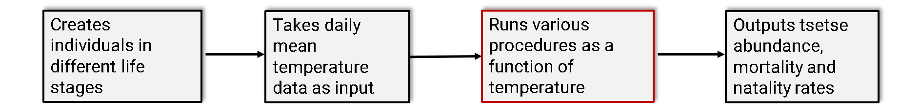

# IBM-for-tsetse-populations-SEAMS-2020
This is a readme for my SEAMS 2020 workshop project. 
The repository contains all  relevant files associated with the Individual Based Model (IBM) for tsetse population. 
# Scientific overview 
Tsetse flies are vectors for both human and animal sleeping sickness. Over the past decades,  temperature has continued to increase in the Zambezi valley of Zimbabwe. My project aims to estimate extinction probability for tsetse populations in the Zambezi valley of Zimbabwe, as temperature and other meteorological factors fluctuate both diurnally and seasonally. 

### Possible impact of study. 
This project can potentially inform policy on the direction of tsetse control/eradication measures in Zimbabwe and other parts of Africa. The results will be widely accessible to a variety of audiences including the global scientific community, government officials, policymakers, etc., as I intend to publish the results in an open-access peer-reviewed scientific journal, and also publish a non-technical version in a science news media e.g. The Conversation - Africa.  
# Current work flow in NetLogo 
The flow daigram below describes the current work flow of my project in NetLogo. 

# Aim
The aim of this project is to apply all the good coding practices that I have learned during the first week of SEAMS to my IBM project, and to create an interface between R and NetLogo to allow more flexibility in the statistcal analysis of the model output. 

# Objectives

- Add comments to the NetLogo code to improve its readability  
- Install RNetLogo package in R to create an interface between R and NetLogo 
- Run several simulations in R and store outputs for statistical analysis 

# Modification

I am making the following changes to my to-do list (after  meeting with some faculty members).

- Clean-up the .csv output from NetLogo by removing unnecessary lines containing NetLogo experiment default settings (they can be accessed in NetLogo) 

- Import the data to R 
- Write R script to reshape the data 
- Change the data format from wide-format to long-format
- Analyze the data to produce a more usable version for further statistical analysis.

